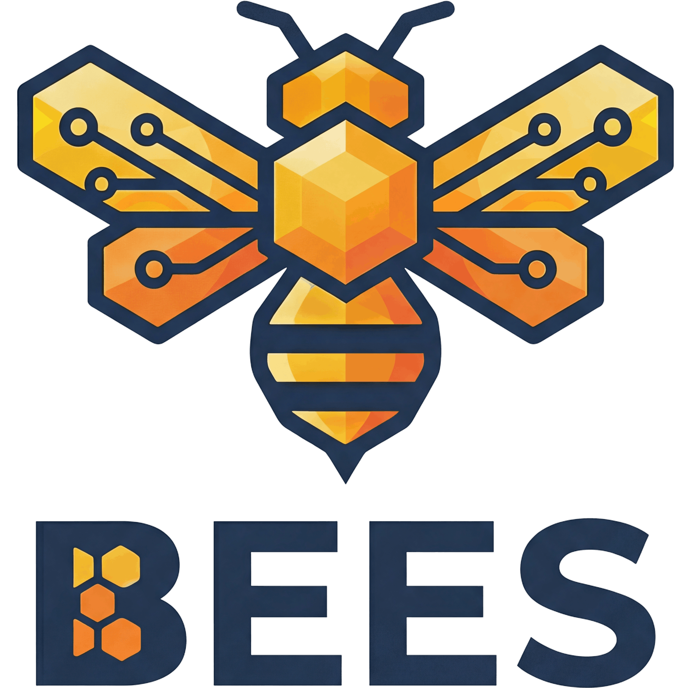

<p align="center">
  
</p>

# bees

A lightweight, local issue tracker backed by SQLite. Single binary, no dependencies, designed to live inside your project directory.

Bees creates a `.bees/` directory in your project root containing a SQLite database and JSONL export. It's compatible with the [vscode-beads](https://marketplace.visualstudio.com/items?itemName=planet57.vscode-beads) extension via a `.beads` symlink, giving you a kanban board and issue panel in VS Code.

## Features

- **Single binary** -- CLI and (future) daemon in one executable
- **SQLite-backed** -- WAL mode for concurrent access, portable database file
- **JSONL export** -- `bees sync` dumps hydrated issues for tooling and AI agents
- **AI context** -- `bees prime` outputs open issues as markdown for LLM context windows
- **JSON output** -- every command supports `--json` for scripting
- **Dependency tracking** -- block/related/parent-child relationships with ready-issue filtering
- **Labels and comments** -- lightweight metadata on issues
- **VS Code compatible** -- `.beads/` symlink lets the vscode-beads extension connect

## Requirements

- [Zig](https://ziglang.org/) 0.15.0 or later

## Build

```sh
zig build
```

The binary is at `zig-out/bin/bees`. Copy it somewhere on your `$PATH`:

```sh
cp zig-out/bin/bees ~/.local/bin/
```

## Quick start

```sh
# Initialize in your project root
cd my-project
bees init

# Create issues
bees create "Fix login redirect" -t bug -p 1 -a alice
bees create "Add user dashboard" -t feature -p 2

# List and inspect
bees list
bees show my-project-1

# Update, label, close
bees update my-project-1 -s in_progress
bees label add my-project-1 security
bees close my-project-1 -r "Fixed in abc123"

# Dependencies
bees dep add my-project-2 my-project-1    # 2 is blocked by 1
bees ready                                 # shows unblocked issues

# Export
bees sync     # writes .bees/issues.jsonl
bees prime    # dumps open issues as markdown
```

## Commands

| Command | Description |
|---------|-------------|
| `bees init` | Initialize bees in the current directory |
| `bees create <title> [opts]` | Create an issue (`-t type`, `-p priority`, `-a assignee`, `-o owner`, `-d description`) |
| `bees list [opts]` | List issues (`-s status`, `-p priority`, `-a assignee`, `--json`) |
| `bees show <id>` | Show issue details (`--json`) |
| `bees update <id> [opts]` | Update fields (`--title`, `-s`, `-p`, `-a`, `-d`, `-t`, `-o`) |
| `bees close <id>` | Close an issue (`-r reason`) |
| `bees ready` | Show issues with no unresolved blockers (`--json`) |
| `bees dep add\|remove\|list` | Manage dependencies (`-t blocks\|related\|parent-child`) |
| `bees label add\|remove <id> <label>` | Manage labels |
| `bees config get\|set <key> [value]` | Read/write config values |
| `bees sync` | Export database to `issues.jsonl` |
| `bees prime` | Dump open issues as AI-friendly markdown |
| `bees daemon start\|stop\|status` | Manage the RPC daemon (Phase 3) |

## Priority levels

| Value | Meaning |
|-------|---------|
| 1 | Critical |
| 2 | High (default) |
| 3 | Medium |
| 4 | Low |

## Issue types

`task` (default), `bug`, `feature`, `epic`, `story`

## Project structure

After `bees init`, your project gets:

```
my-project/
  .bees/
    bees.db          # SQLite database (WAL mode)
    issues.jsonl     # JSONL export (after bees sync)
    metadata.json    # Extension metadata
    config.json      # Project config
    .gitignore       # Ignores db, socket, pid files
  .beads -> .bees    # Symlink for vscode-beads compatibility
```

The `.bees/` directory is self-contained. Commit `issues.jsonl`, `metadata.json`, `config.json`, and `.gitignore` to share issue state. The database and runtime files are git-ignored.

## Tests

```sh
zig build test
```

## License

MIT
